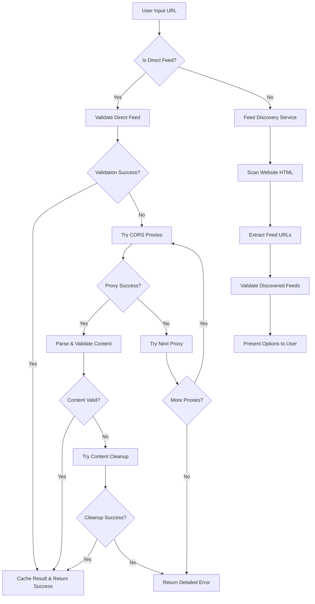

# Design Document

## Overview

The robust feed validation system will enhance the existing RSS feed validation capabilities by implementing intelligent feed discovery, improved CORS handling, better error recovery, and more comprehensive validation logic. The system will be able to automatically discover RSS feeds from website URLs, handle various network issues gracefully, and provide detailed feedback to users about validation attempts.

## Architecture

### Core Components

1. **Enhanced Feed Validator Service** - Extended version of the existing `feedValidator.ts`
2. **Feed Discovery Service** - New service for discovering RSS feeds from websites
3. **CORS Proxy Manager** - Enhanced proxy handling with fallback mechanisms
4. **Validation Cache Manager** - Intelligent caching with different TTL strategies
5. **Feed Content Parser** - Improved RSS/Atom parsing with better error tolerance

### System Flow



## Components and Interfaces

### Enhanced Feed Validator Service

```typescript
interface EnhancedFeedValidationResult extends FeedValidationResult {
  discoveredFeeds?: DiscoveredFeed[];
  validationAttempts: ValidationAttempt[];
  finalMethod: "direct" | "proxy" | "discovery";
  suggestions?: string[];
}

interface ValidationAttempt {
  method: "direct" | "proxy" | "discovery";
  url: string;
  timestamp: number;
  success: boolean;
  error?: string;
  responseTime?: number;
  proxyUsed?: string;
}

interface DiscoveredFeed {
  url: string;
  title?: string;
  description?: string;
  type: "rss" | "atom" | "rdf";
  discoveryMethod: "link-tag" | "meta-tag" | "common-path" | "content-scan";
}

class EnhancedFeedValidatorService extends FeedValidatorService {
  async validateFeedWithDiscovery(
    url: string
  ): Promise<EnhancedFeedValidationResult>;
  async discoverFeeds(websiteUrl: string): Promise<DiscoveredFeed[]>;
  private async tryDirectValidation(url: string): Promise<ValidationAttempt>;
  private async tryProxyValidation(url: string): Promise<ValidationAttempt>;
  private async tryContentCleanup(content: string): Promise<string>;
}
```

### Feed Discovery Service

```typescript
interface FeedDiscoveryService {
  discoverFromWebsite(url: string): Promise<DiscoveredFeed[]>;
  scanHtmlForFeeds(html: string, baseUrl: string): Promise<DiscoveredFeed[]>;
  tryCommonFeedPaths(baseUrl: string): Promise<DiscoveredFeed[]>;
  extractFeedMetadata(feedContent: string): Promise<{
    title?: string;
    description?: string;
    type: "rss" | "atom" | "rdf";
  }>;
}

class FeedDiscoveryServiceImpl implements FeedDiscoveryService {
  private readonly COMMON_FEED_PATHS = [
    "/rss.xml",
    "/feed.xml",
    "/atom.xml",
    "/rss",
    "/feed",
    "/feeds/all.atom.xml",
    "/feeds/posts/default",
    "/blog/rss.xml",
    "/blog/feed.xml",
    "/news/rss.xml",
  ];

  private readonly FEED_DISCOVERY_SELECTORS = [
    'link[type="application/rss+xml"]',
    'link[type="application/atom+xml"]',
    'link[type="application/rdf+xml"]',
    'link[rel="alternate"][type*="xml"]',
    'meta[property="og:rss"]',
    'meta[name="rss"]',
  ];
}
```

### Enhanced CORS Proxy Manager

```typescript
interface ProxyConfig {
  url: string;
  name: string;
  responseTransform?: (response: string) => string;
  headers?: Record<string, string>;
  timeout?: number;
  priority: number;
}

interface ProxyManager {
  getAvailableProxies(): ProxyConfig[];
  tryProxy(proxyConfig: ProxyConfig, targetUrl: string): Promise<string>;
  markProxyStatus(proxyUrl: string, success: boolean): void;
  getProxyStats(): Map<
    string,
    { success: number; failures: number; avgResponseTime: number }
  >;
}

class EnhancedProxyManager implements ProxyManager {
  private readonly PROXY_CONFIGS: ProxyConfig[] = [
    {
      url: "https://api.allorigins.win/get?url=",
      name: "AllOrigins",
      responseTransform: (response) => JSON.parse(response).contents,
      priority: 1,
    },
    {
      url: "https://corsproxy.io/?",
      name: "CorsProxy.io",
      priority: 2,
    },
    {
      url: "https://cors-anywhere.herokuapp.com/",
      name: "CORS Anywhere",
      priority: 3,
    },
    {
      url: "https://api.codetabs.com/v1/proxy?quest=",
      name: "CodeTabs",
      priority: 4,
    },
  ];

  private proxyStats = new Map<string, ProxyStats>();
  private proxyHealthCheck = new Map<string, boolean>();
}
```

### Validation Cache Manager

```typescript
interface CacheEntry<T> {
  data: T;
  timestamp: number;
  ttl: number;
  accessCount: number;
  lastAccessed: number;
}

interface ValidationCacheManager {
  get<T>(key: string): CacheEntry<T> | null;
  set<T>(key: string, data: T, ttl?: number): void;
  invalidate(key: string): void;
  cleanup(): void;
  getStats(): CacheStats;
}

class SmartValidationCache implements ValidationCacheManager {
  private readonly DEFAULT_SUCCESS_TTL = 30 * 60 * 1000; // 30 minutes
  private readonly DEFAULT_FAILURE_TTL = 5 * 60 * 1000; // 5 minutes
  private readonly DISCOVERY_TTL = 60 * 60 * 1000; // 1 hour

  private cache = new Map<string, CacheEntry<any>>();

  // Different TTL strategies based on result type
  private getTTL(key: string, data: any): number {
    if (key.includes("discovery:")) return this.DISCOVERY_TTL;
    if (data.isValid === true) return this.DEFAULT_SUCCESS_TTL;
    return this.DEFAULT_FAILURE_TTL;
  }
}
```

## Data Models

### Enhanced Validation Result

```typescript
interface EnhancedFeedValidationResult {
  // Existing fields from FeedValidationResult
  url: string;
  isValid: boolean;
  status:
    | "valid"
    | "invalid"
    | "timeout"
    | "network_error"
    | "parse_error"
    | "checking"
    | "discovery_required";
  statusCode?: number;
  error?: string;
  responseTime?: number;
  lastChecked: number;
  title?: string;
  description?: string;

  // New enhanced fields
  discoveredFeeds?: DiscoveredFeed[];
  validationAttempts: ValidationAttempt[];
  finalMethod: "direct" | "proxy" | "discovery";
  suggestions: string[];
  proxyUsed?: string;
  contentCleanupApplied?: boolean;
  feedType?: "rss" | "atom" | "rdf";
  encoding?: string;
  lastModified?: string;
  etag?: string;
}
```

### Feed Discovery Models

```typescript
interface DiscoveredFeed {
  url: string;
  title?: string;
  description?: string;
  type: "rss" | "atom" | "rdf";
  discoveryMethod: "link-tag" | "meta-tag" | "common-path" | "content-scan";
  confidence: number; // 0-1 score based on discovery method and validation
  lastValidated?: number;
  validationResult?: FeedValidationResult;
}

interface FeedDiscoveryResult {
  originalUrl: string;
  discoveredFeeds: DiscoveredFeed[];
  discoveryMethods: string[];
  totalAttempts: number;
  successfulAttempts: number;
  discoveryTime: number;
  suggestions: string[];
}
```

## Error Handling

### Error Classification

```typescript
enum ValidationErrorType {
  NETWORK_ERROR = "network_error",
  CORS_ERROR = "cors_error",
  TIMEOUT_ERROR = "timeout_error",
  PARSE_ERROR = "parse_error",
  INVALID_FORMAT = "invalid_format",
  NOT_FOUND = "not_found",
  SERVER_ERROR = "server_error",
  DISCOVERY_FAILED = "discovery_failed",
}

interface ValidationError {
  type: ValidationErrorType;
  message: string;
  originalError?: Error;
  suggestions: string[];
  retryable: boolean;
  context?: {
    url?: string;
    method?: string;
    proxy?: string;
    attempt?: number;
  };
}
```

### Error Recovery Strategies

1. **CORS Errors**: Automatically try alternative proxy services
2. **Timeout Errors**: Retry with increased timeout and exponential backoff
3. **Parse Errors**: Apply content cleanup and try alternative parsing methods
4. **Not Found Errors**: Trigger feed discovery process
5. **Server Errors**: Implement retry logic with different intervals

### User-Friendly Error Messages

```typescript
const ERROR_MESSAGES: Record<ValidationErrorType, (context?: any) => string> = {
  [ValidationErrorType.NETWORK_ERROR]: () =>
    "Unable to connect to the feed. Please check your internet connection and try again.",

  [ValidationErrorType.CORS_ERROR]: () =>
    "The feed server doesn't allow direct access. We're trying alternative methods...",

  [ValidationErrorType.TIMEOUT_ERROR]: (context) =>
    `The feed is taking too long to respond (>${
      context?.timeout || 5000
    }ms). The server might be slow or overloaded.`,

  [ValidationErrorType.PARSE_ERROR]: () =>
    "The feed content appears to be malformed. We're attempting to clean and re-parse it.",

  [ValidationErrorType.INVALID_FORMAT]: () =>
    "This doesn't appear to be a valid RSS or Atom feed. Try entering a website URL instead.",

  [ValidationErrorType.NOT_FOUND]: () =>
    "Feed not found at this URL. We'll search the website for available feeds.",

  [ValidationErrorType.DISCOVERY_FAILED]: () =>
    "No RSS feeds found on this website. Please check if the site provides RSS feeds.",
};
```

## Testing Strategy

### Unit Tests

1. **Feed Discovery Service Tests**

   - Test HTML parsing for feed links
   - Test common path discovery
   - Test metadata extraction
   - Test error handling for malformed HTML

2. **Enhanced Validator Tests**

   - Test direct validation with various feed formats
   - Test proxy fallback mechanisms
   - Test content cleanup functionality
   - Test caching behavior with different TTL strategies

3. **CORS Proxy Manager Tests**
   - Test proxy rotation and fallback
   - Test proxy health monitoring
   - Test response transformation
   - Test timeout handling

### Integration Tests

1. **End-to-End Validation Flow**

   - Test complete validation process from URL input to result
   - Test discovery process for websites without direct feeds
   - Test error recovery and retry mechanisms

2. **Real Feed Testing**
   - Test with actual RSS feeds from popular websites
   - Test with feeds that have known issues (CORS, formatting, etc.)
   - Test performance with large feeds

### Performance Tests

1. **Concurrent Validation**

   - Test validation of multiple feeds simultaneously
   - Test cache performance under load
   - Test proxy performance and failover

2. **Memory and Resource Usage**
   - Test cache memory usage and cleanup
   - Test resource cleanup after validation failures

## Implementation Phases

### Phase 1: Enhanced Core Validation

- Extend existing `feedValidator.ts` with better error handling
- Implement improved CORS proxy management
- Add content cleanup and retry logic
- Enhance caching with smart TTL strategies

### Phase 2: Feed Discovery Service

- Implement HTML parsing for feed discovery
- Add common path checking
- Create feed metadata extraction
- Integrate discovery with validation flow

### Phase 3: User Experience Improvements

- Add detailed progress feedback during validation
- Implement feed selection UI for discovered feeds
- Add validation attempt history display
- Create actionable error messages and suggestions

### Phase 4: Advanced Features

- Implement background revalidation
- Add feed health monitoring
- Create validation analytics and reporting
- Add feed recommendation based on discovery patterns

## Security Considerations

1. **Input Sanitization**: All URLs and HTML content must be properly sanitized
2. **CORS Proxy Security**: Validate proxy responses and implement rate limiting
3. **Content Validation**: Ensure parsed feed content is safe and doesn't contain malicious scripts
4. **Cache Security**: Implement secure cache keys and prevent cache poisoning
5. **Error Information**: Avoid exposing sensitive server information in error messages

## Performance Optimizations

1. **Parallel Processing**: Validate multiple feeds and try multiple proxies concurrently
2. **Smart Caching**: Different cache strategies for different types of results
3. **Request Deduplication**: Avoid duplicate requests for the same URL
4. **Background Processing**: Move heavy operations to background where possible
5. **Resource Cleanup**: Proper cleanup of network resources and timeouts
