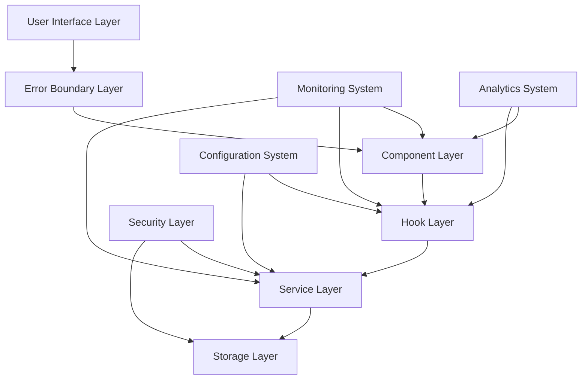
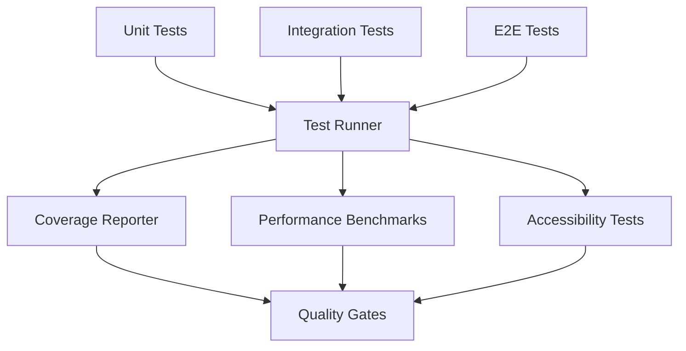

# Design Document

## Overview

This design document outlines the architecture and implementation approach for comprehensive code quality improvements to the Personal News Dashboard. The improvements focus on enhancing error handling, performance monitoring, security, user experience, and maintainability while maintaining the existing functionality and performance characteristics.

## Architecture

### High-Level Architecture



### Core Systems Integration

1. **Error Handling System**: Wraps all major components with error boundaries
2. **Performance Monitoring**: Integrates with existing performance utilities
3. **Logging System**: Centralized logging with configurable levels
4. **Security Layer**: Input sanitization and CSP enforcement
5. **Configuration Management**: Environment-aware configuration system

## Components and Interfaces

### 1. Error Handling System

#### Error Boundary Component

```typescript
interface ErrorBoundaryProps {
  fallback?: React.ComponentType<ErrorFallbackProps>;
  onError?: (error: Error, errorInfo: ErrorInfo) => void;
  isolate?: boolean;
}

interface ErrorFallbackProps {
  error?: Error;
  resetError?: () => void;
  retry?: () => void;
}
```

#### Error Recovery Service

```typescript
interface ErrorRecoveryService {
  registerRecoveryStrategy(errorType: string, strategy: RecoveryStrategy): void;
  attemptRecovery(error: Error): Promise<boolean>;
  reportError(error: Error, context: ErrorContext): void;
}
```

### 2. Enhanced Performance Monitoring

#### Performance Monitor Interface

```typescript
interface PerformanceMonitor {
  trackWebVitals(): void;
  measureComponentRender(componentName: string): PerformanceTimer;
  trackUserInteraction(interaction: UserInteraction): void;
  generateReport(): PerformanceReport;
}

interface WebVitalsMetrics {
  FCP: number; // First Contentful Paint
  LCP: number; // Largest Contentful Paint
  FID: number; // First Input Delay
  CLS: number; // Cumulative Layout Shift
  TTFB: number; // Time to First Byte
}
```

#### Performance Dashboard Component

```typescript
interface PerformanceDashboardProps {
  realTimeMetrics: boolean;
  historicalData: boolean;
  exportCapability: boolean;
}
```

### 3. Logging System

#### Logger Interface

```typescript
interface Logger {
  debug(message: string, context?: LogContext): void;
  info(message: string, context?: LogContext): void;
  warn(message: string, context?: LogContext): void;
  error(message: string, error?: Error, context?: LogContext): void;
}

interface LogContext {
  component?: string;
  userId?: string;
  sessionId?: string;
  timestamp?: number;
  additionalData?: Record<string, any>;
}
```

#### Log Transport Interface

```typescript
interface LogTransport {
  send(logEntry: LogEntry): Promise<void>;
  batch(logEntries: LogEntry[]): Promise<void>;
  configure(config: TransportConfig): void;
}
```

### 4. User Experience Enhancements

#### Notification System

```typescript
interface NotificationManager {
  show(notification: NotificationConfig): string;
  dismiss(id: string): void;
  dismissAll(): void;
  configure(config: NotificationSystemConfig): void;
}

interface NotificationConfig {
  type: "success" | "error" | "warning" | "info";
  title: string;
  message: string;
  duration?: number;
  actions?: NotificationAction[];
}
```

#### Skeleton Loader System

```typescript
interface SkeletonLoaderProps {
  variant: "text" | "rectangular" | "circular";
  width?: string | number;
  height?: string | number;
  animation?: "pulse" | "wave" | "none";
}
```

### 5. Security Enhancements

#### Content Sanitizer

```typescript
interface ContentSanitizer {
  sanitizeHtml(html: string, options?: SanitizeOptions): string;
  sanitizeUrl(url: string): string;
  validateInput(input: string, rules: ValidationRules): ValidationResult;
}

interface SanitizeOptions {
  allowedTags?: string[];
  allowedAttributes?: string[];
  allowDataAttributes?: boolean;
}
```

#### Security Policy Enforcer

```typescript
interface SecurityPolicyEnforcer {
  enforceCSP(policy: CSPPolicy): void;
  validateOrigin(origin: string): boolean;
  checkPermissions(resource: string, action: string): boolean;
}
```

### 6. Configuration Management

#### Configuration Manager

```typescript
interface ConfigurationManager {
  get<T>(key: string, defaultValue?: T): T;
  set(key: string, value: any): void;
  getEnvironment(): Environment;
  validateConfig(): ValidationResult;
}

interface AppConfiguration {
  api: ApiConfig;
  cache: CacheConfig;
  performance: PerformanceConfig;
  features: FeatureFlags;
  security: SecurityConfig;
}
```

### 7. Analytics System

#### Analytics Interface

```typescript
interface AnalyticsService {
  track(event: AnalyticsEvent): void;
  identify(userId: string, traits?: UserTraits): void;
  page(pageName: string, properties?: PageProperties): void;
  configure(config: AnalyticsConfig): void;
}

interface AnalyticsEvent {
  name: string;
  properties?: Record<string, any>;
  timestamp?: number;
  userId?: string;
  sessionId?: string;
}
```

## Data Models

### Error Models

```typescript
interface ErrorReport {
  id: string;
  timestamp: number;
  error: SerializedError;
  context: ErrorContext;
  userAgent: string;
  url: string;
  userId?: string;
  sessionId: string;
}

interface SerializedError {
  name: string;
  message: string;
  stack?: string;
  cause?: SerializedError;
}
```

### Performance Models

```typescript
interface PerformanceMetric {
  name: string;
  value: number;
  unit: string;
  timestamp: number;
  context?: Record<string, any>;
}

interface PerformanceReport {
  id: string;
  timestamp: number;
  metrics: PerformanceMetric[];
  webVitals: WebVitalsMetrics;
  resourceTiming: ResourceTiming[];
  userTiming: UserTiming[];
}
```

### Configuration Models

```typescript
interface EnvironmentConfig {
  name: Environment;
  api: {
    baseUrl: string;
    timeout: number;
    retryAttempts: number;
  };
  logging: {
    level: LogLevel;
    transports: LogTransportConfig[];
  };
  features: FeatureFlags;
}
```

## Error Handling

### Error Boundary Strategy

1. **Component-Level Boundaries**: Wrap major UI sections
2. **Route-Level Boundaries**: Protect entire page components
3. **Service-Level Error Handling**: Graceful degradation for API failures
4. **Global Error Handler**: Catch unhandled promise rejections

### Error Recovery Mechanisms

```typescript
const recoveryStrategies = {
  NetworkError: async () => {
    // Retry with exponential backoff
    await retryWithBackoff(originalRequest, { maxAttempts: 3 });
  },

  CacheError: async () => {
    // Clear corrupted cache and reload
    await clearCache();
    window.location.reload();
  },

  ComponentError: () => {
    // Reset component state
    return { hasError: false };
  },
};
```

### Error Reporting Pipeline

1. **Local Logging**: Store errors in IndexedDB
2. **Batch Reporting**: Send errors in batches to reduce network overhead
3. **Privacy Filtering**: Remove sensitive information before reporting
4. **Rate Limiting**: Prevent error spam

## Testing Strategy

### Test Architecture



### Test Categories

#### 1. Unit Tests

- Component rendering and behavior
- Hook functionality and state management
- Service layer logic and error handling
- Utility function correctness

#### 2. Integration Tests

- Component interaction and data flow
- Service integration and API communication
- Error boundary behavior
- Performance monitoring accuracy

#### 3. End-to-End Tests

- Complete user workflows
- Cross-browser compatibility
- Performance under load
- Accessibility compliance

#### 4. Performance Tests

- Component render time benchmarks
- Memory usage monitoring
- Bundle size tracking
- Core Web Vitals measurement

### Test Data Management

```typescript
interface TestDataFactory {
  createArticle(overrides?: Partial<Article>): Article;
  createFeedSource(overrides?: Partial<FeedSource>): FeedSource;
  createPerformanceMetrics(): PerformanceMetrics;
  createErrorReport(): ErrorReport;
}
```

## Security Considerations

### Content Security Policy

```typescript
const cspPolicy = {
  "default-src": ["'self'"],
  "script-src": ["'self'", "'unsafe-inline'"],
  "style-src": ["'self'", "'unsafe-inline'"],
  "img-src": ["'self'", "data:", "https:"],
  "connect-src": [
    "'self'",
    "https://api.rss2json.com",
    "https://api.open-meteo.com",
  ],
  "font-src": ["'self'"],
  "object-src": ["'none'"],
  "base-uri": ["'self'"],
  "form-action": ["'self'"],
};
```

### Input Sanitization Strategy

1. **HTML Sanitization**: Use DOMPurify for RSS content
2. **URL Validation**: Strict protocol and domain validation
3. **Input Validation**: Schema-based validation for all user inputs
4. **Output Encoding**: Proper encoding for different contexts

### Data Protection

1. **Local Storage Encryption**: Encrypt sensitive data in localStorage
2. **Session Management**: Secure session handling and cleanup
3. **Privacy Controls**: User consent and data deletion capabilities
4. **Audit Logging**: Track access to sensitive operations

## Performance Optimizations

### Bundle Optimization

```typescript
const bundleConfig = {
  chunks: {
    vendor: ["react", "react-dom"],
    common: ["./hooks/", "./services/"],
    components: ["./components/"],
    lazy: ["./components/modals/"],
  },
  optimization: {
    splitChunks: true,
    treeshaking: true,
    minification: true,
  },
};
```

### Caching Strategy

1. **Service Worker**: Intelligent caching with different strategies
2. **Memory Cache**: In-memory caching for frequently accessed data
3. **IndexedDB**: Persistent storage for offline capabilities
4. **HTTP Cache**: Proper cache headers for static resources

### Loading Optimizations

1. **Code Splitting**: Route-based and component-based splitting
2. **Lazy Loading**: Defer loading of non-critical components
3. **Preloading**: Strategic preloading of likely-needed resources
4. **Resource Hints**: DNS prefetch and preconnect for external resources

## Monitoring and Observability

### Metrics Collection

```typescript
interface MetricsCollector {
  collectWebVitals(): WebVitalsMetrics;
  collectResourceMetrics(): ResourceMetrics;
  collectUserMetrics(): UserMetrics;
  collectErrorMetrics(): ErrorMetrics;
}
```

### Dashboard Components

1. **Real-time Performance**: Live metrics and alerts
2. **Historical Trends**: Performance over time
3. **Error Tracking**: Error rates and patterns
4. **User Analytics**: Usage patterns and behavior

### Alerting System

```typescript
interface AlertingSystem {
  defineAlert(condition: AlertCondition, action: AlertAction): void;
  checkConditions(): void;
  sendAlert(alert: Alert): void;
}
```

## Deployment and DevOps

### Build Pipeline

1. **Code Quality Checks**: Linting, formatting, type checking
2. **Test Execution**: All test suites with coverage requirements
3. **Security Scanning**: Dependency and code security analysis
4. **Performance Budgets**: Bundle size and performance thresholds
5. **Accessibility Audits**: Automated accessibility testing

### Environment Management

```typescript
const environments = {
  development: {
    logging: { level: "DEBUG" },
    performance: { monitoring: true },
    features: { all: true },
  },
  staging: {
    logging: { level: "INFO" },
    performance: { monitoring: true },
    features: { stable: true },
  },
  production: {
    logging: { level: "WARN" },
    performance: { monitoring: false },
    features: { production: true },
  },
};
```

This design provides a comprehensive foundation for implementing robust code quality improvements while maintaining the existing functionality and performance characteristics of the Personal News Dashboard.
