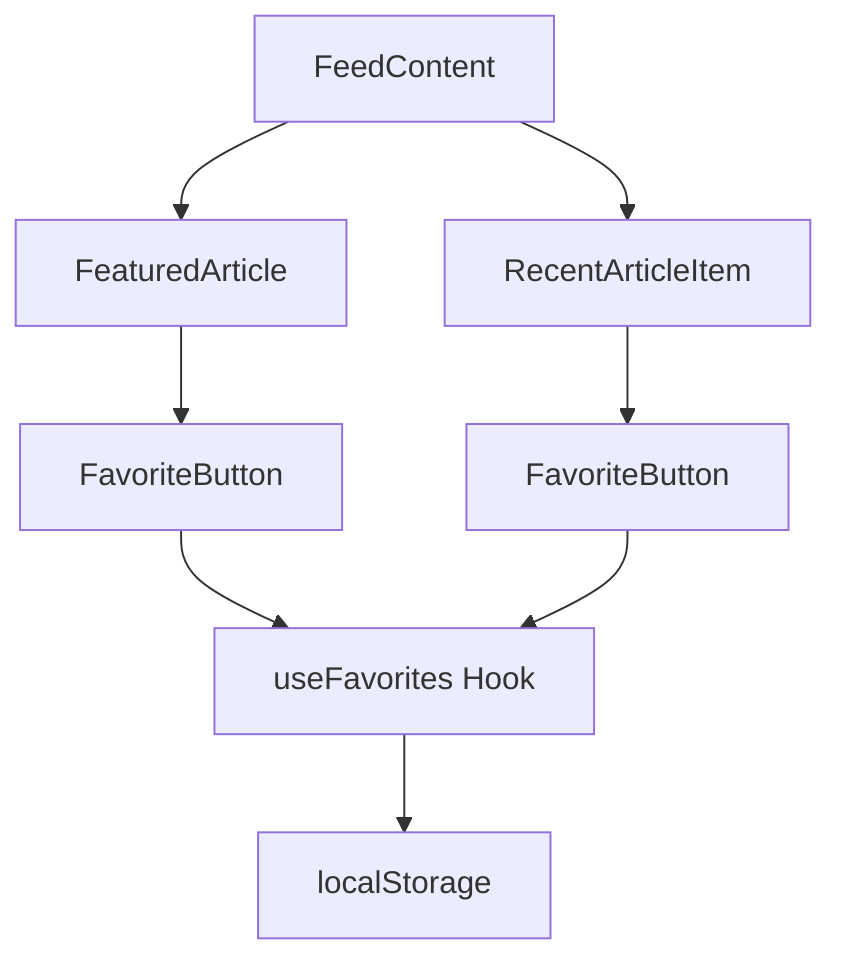
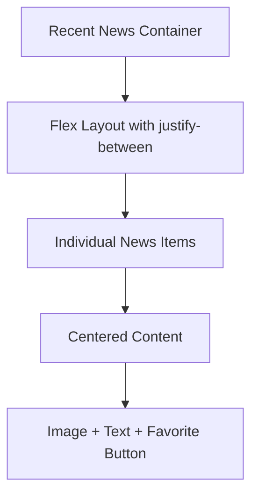

# Design Document

## Overview

Este documento detalha o design técnico para implementar correções específicas na interface do Personal News Dashboard, focando no alinhamento vertical da seção "Últimas Notícias" e na adição de funcionalidade de favoritos para a notícia principal e itens das últimas notícias.

## Architecture

### Component Structure



### Layout Architecture



## Components and Interfaces

### Enhanced FeaturedArticle Component

```typescript
interface FeaturedArticleProps {
  article: Article;
  timeFormat?: "12h" | "24h";
}

// Adicionar funcionalidade de favoritos
const FeaturedArticle: React.FC<FeaturedArticleProps> = ({
  article,
  timeFormat = "24h",
}) => {
  const { isFavorite, toggleFavorite } = useFavorites();
  // ... resto da implementação
};
```

### Enhanced RecentArticleItem Component

```typescript
interface RecentArticleItemProps {
  article: Article;
  timeFormat: "12h" | "24h";
  showTime: boolean;
}

// Adicionar funcionalidade de favoritos e melhorar layout
const RecentArticleItem: React.FC<RecentArticleItemProps> = ({
  article,
  timeFormat,
  showTime,
}) => {
  const { isFavorite, toggleFavorite } = useFavorites();
  // ... implementação com layout centralizado
};
```

### Shared FavoriteButton Component

```typescript
interface FavoriteButtonProps {
  article: Article;
  size?: "small" | "medium" | "large";
  position?: "overlay" | "inline";
  className?: string;
}

const FavoriteButton: React.FC<FavoriteButtonProps> = ({
  article,
  size = "medium",
  position = "overlay",
  className = "",
}) => {
  const { isFavorite, toggleFavorite } = useFavorites();

  const handleToggle = useCallback(
    (e: React.MouseEvent) => {
      e.preventDefault();
      e.stopPropagation();
      toggleFavorite(article);
    },
    [toggleFavorite, article]
  );

  const sizeClasses = {
    small: "w-6 h-6 p-1",
    medium: "w-8 h-8 p-1.5",
    large: "w-10 h-10 p-2",
  };

  return (
    <button
      onClick={handleToggle}
      className={`
        ${sizeClasses[size]}
        ${position === "overlay" ? "absolute" : "relative"}
        rounded-full bg-black/70 backdrop-blur-sm transition-all duration-200
        ${
          isFavorite(article)
            ? "text-red-500 hover:text-red-400"
            : "text-white hover:text-red-500"
        }
        flex items-center justify-center
        ${className}
      `}
      aria-label={
        isFavorite(article) ? "Remove from favorites" : "Add to favorites"
      }
      title={isFavorite(article) ? "Remove from favorites" : "Add to favorites"}
    >
      <HeartIcon filled={isFavorite(article)} />
    </button>
  );
};
```

## Data Models

### No changes needed to existing data models

Os modelos de dados existentes (`Article`, `FavoriteItem`) já suportam a funcionalidade necessária através do hook `useFavorites`.

## Error Handling

### Favorite Operation Errors

- **Storage Quota Exceeded**: Implementar fallback gracioso quando localStorage está cheio
- **Invalid Article Data**: Validar dados do artigo antes de adicionar aos favoritos
- **Concurrent Modifications**: Implementar debouncing para evitar cliques múltiplos

### Layout Rendering Errors

- **Missing Images**: Fallback para placeholder quando imagem não carrega
- **Content Overflow**: Implementar truncamento adequado para textos longos
- **Responsive Breakpoints**: Garantir que o layout funcione em todas as resoluções

## Testing Strategy

### Visual Regression Testing

```typescript
describe("Recent News Layout", () => {
  it("should center items vertically in their containers", () => {
    render(<RecentArticleItem article={mockArticle} />);

    const container = screen.getByRole("article");
    const computedStyle = window.getComputedStyle(container);

    expect(computedStyle.display).toBe("flex");
    expect(computedStyle.alignItems).toBe("center");
  });
});
```

### Favorites Functionality Testing

```typescript
describe("Favorites Integration", () => {
  it("should add featured article to favorites", () => {
    const { toggleFavorite } = renderHook(() => useFavorites()).result.current;

    render(<FeaturedArticle article={mockArticle} />);

    const favoriteButton = screen.getByLabelText("Add to favorites");
    fireEvent.click(favoriteButton);

    expect(toggleFavorite).toHaveBeenCalledWith(mockArticle);
  });
});
```

## Implementation Details

### CSS Layout Improvements

#### Recent News Container Vertical Centering

```css
.recent-news-container {
  display: flex;
  flex-direction: column;
  justify-content: space-between;
  height: 100%;
  gap: 0.5rem;
}

.recent-news-item {
  display: flex;
  align-items: center;
  flex: 1;
  min-height: 0;
  padding: 0.5rem 0;
}

.recent-news-item:not(:last-child) {
  border-bottom: 1px solid rgba(107, 114, 128, 0.3);
}

/* Garantir que cada item ocupe espaço igual */
.recent-news-item {
  flex-basis: 0;
  flex-grow: 1;
}
```

#### Responsive Adjustments

```css
@media (max-width: 1199px) {
  .recent-news-container {
    gap: 0.25rem;
  }

  .recent-news-item {
    padding: 0.375rem 0;
  }
}

@media (max-width: 768px) {
  .recent-news-container {
    gap: 0.25rem;
  }

  .recent-news-item {
    padding: 0.25rem 0;
  }
}
```

### Favorite Button Positioning

#### Featured Article Favorite Button

```typescript
// Posicionamento no canto superior direito da imagem
<div className="absolute top-4 right-4 z-10">
  <FavoriteButton article={article} size="large" position="overlay" />
</div>
```

#### Recent News Favorite Button

```typescript
// Posicionamento à direita do conteúdo
<div className="flex items-start space-x-3">
  <div className="flex-shrink-0 w-1.5 h-1.5 rounded-full bg-[rgb(var(--color-accent))] mt-1.5"></div>
  <SmallOptimizedImage />
  <div className="flex-1 min-w-0">{/* Conteúdo do artigo */}</div>
  <div className="flex-shrink-0">
    <FavoriteButton article={article} size="small" position="inline" />
  </div>
</div>
```

### Performance Considerations

#### Memoization Strategy

```typescript
// Memoizar componentes para evitar re-renders desnecessários
const RecentArticleItem = memo(
  RecentArticleItemComponent,
  (prevProps, nextProps) => {
    return (
      prevProps.article.link === nextProps.article.link &&
      prevProps.timeFormat === nextProps.timeFormat &&
      prevProps.showTime === nextProps.showTime
    );
  }
);

const FavoriteButton = memo(FavoriteButtonComponent, (prevProps, nextProps) => {
  return (
    prevProps.article.link === nextProps.article.link &&
    prevProps.size === nextProps.size &&
    prevProps.position === nextProps.position
  );
});
```

#### Event Handler Optimization

```typescript
// Usar useCallback para otimizar event handlers
const handleToggleFavorite = useCallback(
  (e: React.MouseEvent) => {
    e.preventDefault();
    e.stopPropagation();
    toggleFavorite(article);
  },
  [toggleFavorite, article.link] // Dependência específica para evitar re-criação
);
```

## Accessibility Considerations

### ARIA Labels and Roles

```typescript
// Botões de favoritar com labels apropriados
<button
  aria-label={isFavorited ? "Remove from favorites" : "Add to favorites"}
  aria-pressed={isFavorited}
  role="button"
>
```

### Keyboard Navigation

```typescript
// Garantir que botões sejam acessíveis via teclado
<button
  onKeyDown={(e) => {
    if (e.key === 'Enter' || e.key === ' ') {
      e.preventDefault();
      handleToggleFavorite(e);
    }
  }}
>
```

### Screen Reader Support

```typescript
// Anúncios para mudanças de estado
const announceToScreenReader = (message: string) => {
  const announcement = document.createElement("div");
  announcement.setAttribute("aria-live", "polite");
  announcement.setAttribute("aria-atomic", "true");
  announcement.className = "sr-only";
  announcement.textContent = message;
  document.body.appendChild(announcement);

  setTimeout(() => {
    document.body.removeChild(announcement);
  }, 1000);
};
```

## Browser Compatibility

### CSS Flexbox Support

- **Modern Browsers**: Usar flexbox para layout vertical
- **Legacy Support**: Fallback para display: table-cell se necessário

### JavaScript Features

- **Event Handling**: Usar addEventListener com passive listeners quando apropriado
- **Local Storage**: Implementar fallback para cookies se localStorage não disponível

## Migration Strategy

### Backward Compatibility

1. **Gradual Rollout**: Implementar mudanças sem quebrar funcionalidade existente
2. **Feature Flags**: Usar flags para controlar ativação de novas funcionalidades
3. **Data Migration**: Garantir que favoritos existentes continuem funcionando

### Testing Approach

1. **Unit Tests**: Testar componentes individuais
2. **Integration Tests**: Testar interação entre componentes
3. **Visual Tests**: Verificar layout em diferentes resoluções
4. **Accessibility Tests**: Validar conformidade com WCAG
