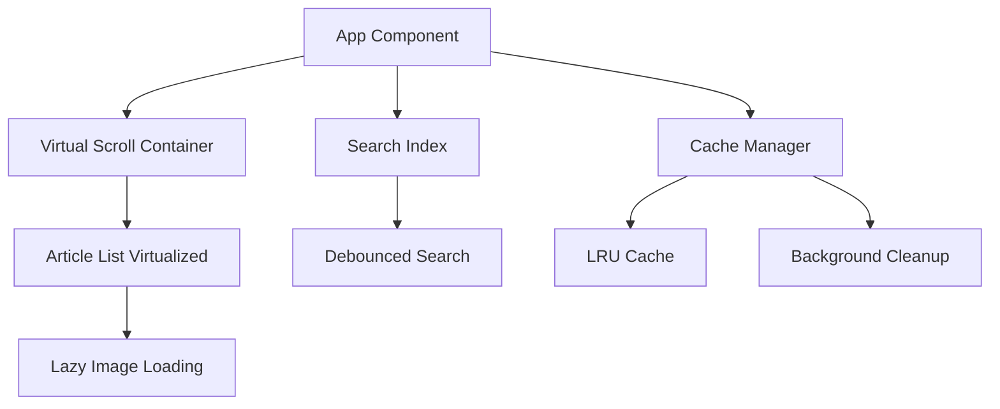
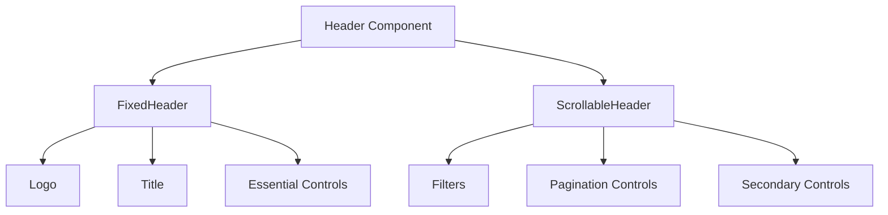

# Design Document

## Overview

Este documento detalha o design técnico para implementar melhorias significativas na interface e performance do Personal News Dashboard. As melhorias focam em responsividade, acessibilidade, performance e customização, mantendo a arquitetura existente baseada em React hooks e localStorage.

## Architecture

### Performance Architecture



### State Management Enhancement

- **Performance State**: Novo hook `usePerformance` para métricas e otimizações
- **Search State**: Hook `useSearch` para busca em tempo real com debouncing
- **Theme State**: Expansão do `useLocalStorage` para temas avançados
- **Accessibility State**: Hook `useA11y` para gerenciamento de foco e ARIA

## Components and Interfaces

### New Components

#### VirtualizedArticleList

```typescript
interface VirtualizedArticleListProps {
  articles: Article[];
  itemHeight: number;
  containerHeight: number;
  renderItem: (article: Article, index: number) => React.ReactNode;
  onLoadMore?: () => void;
}
```

#### SearchBar

```typescript
interface SearchBarProps {
  onSearch: (query: string) => void;
  placeholder?: string;
  debounceMs?: number;
  showFilters?: boolean;
}
```

#### LazyImage

```typescript
interface LazyImageProps {
  src: string;
  alt: string;
  placeholder?: string;
  className?: string;
  onLoad?: () => void;
  onError?: () => void;
}
```

#### ThemeCustomizer

```typescript
interface ThemeCustomizerProps {
  currentTheme: ExtendedTheme;
  onThemeChange: (theme: ExtendedTheme) => void;
  presets: ThemePreset[];
}

interface ExtendedTheme {
  colors: {
    primary: string;
    secondary: string;
    accent: string;
    background: string;
    surface: string;
    text: string;
  };
  layout: "compact" | "comfortable" | "spacious";
  density: "low" | "medium" | "high";
}
```

### Enhanced Existing Components

#### Header Enhancements

- Adicionar SearchBar integrada
- Melhorar navegação por teclado
- Implementar breadcrumbs para categorias
- Adicionar indicadores de performance

#### ArticleItem Enhancements

- Estados de lido/não lido
- Botão de favoritar
- Lazy loading de imagens
- Melhor estrutura semântica (article, header, time)

#### Modal Enhancements

- Gerenciamento de foco (focus trap)
- Suporte a ESC key
- Backdrop click handling
- Animações suaves

## Data Models

### Performance Metrics

```typescript
interface PerformanceMetrics {
  loadTime: number;
  renderTime: number;
  memoryUsage: number;
  cacheHitRate: number;
  networkRequests: number;
}
```

### Search Index

```typescript
interface SearchIndex {
  articles: Map<string, Article>;
  titleIndex: Map<string, string[]>;
  contentIndex: Map<string, string[]>;
  categoryIndex: Map<string, string[]>;
  lastUpdated: number;
}
```

### User Preferences

```typescript
interface UserPreferences extends UserSettings {
  accessibility: {
    highContrast: boolean;
    reducedMotion: boolean;
    fontSize: "small" | "medium" | "large";
    focusVisible: boolean;
  };
  performance: {
    lazyLoading: boolean;
    imageQuality: "low" | "medium" | "high";
    cacheSize: number;
    autoRefresh: boolean;
  };
  layout: {
    articlesPerPage: number;
    showImages: boolean;
    compactMode: boolean;
    sidebarPosition: "left" | "right" | "hidden";
  };
}
```

## Error Handling

### Performance Error Handling

- **Memory Overflow**: Implementar limpeza automática quando uso de memória excede limites
- **Slow Network**: Fallback para modo offline com cache
- **Large Dataset**: Paginação automática quando número de artigos excede threshold
- **Image Loading Failures**: Placeholder com retry mechanism

### Accessibility Error Handling

- **Focus Management**: Restaurar foco quando modais fecham
- **Screen Reader**: Fallbacks para elementos não suportados
- **Keyboard Navigation**: Skip links para navegação rápida

## Testing Strategy

### Performance Testing

```typescript
// Exemplo de teste de performance
describe("VirtualizedArticleList Performance", () => {
  it("should render 1000+ articles without lag", async () => {
    const articles = generateMockArticles(1000);
    const { container } = render(
      <VirtualizedArticleList articles={articles} />
    );

    const startTime = performance.now();
    // Simulate scrolling
    fireEvent.scroll(container, { target: { scrollTop: 5000 } });
    const endTime = performance.now();

    expect(endTime - startTime).toBeLessThan(16); // 60fps
  });
});
```

### Accessibility Testing

```typescript
// Exemplo de teste de acessibilidade
describe("Accessibility Compliance", () => {
  it("should be navigable by keyboard only", async () => {
    render(<App />);

    // Test tab navigation
    userEvent.tab();
    expect(screen.getByRole("button", { name: /manage feeds/i })).toHaveFocus();

    // Test enter key activation
    userEvent.keyboard("{Enter}");
    expect(screen.getByRole("dialog")).toBeInTheDocument();
  });
});
```

### Visual Regression Testing

- Screenshot testing para diferentes temas
- Responsive design testing em múltiplas resoluções
- Animation testing para transições suaves

## Implementation Phases

### Phase 1: Core Performance (Semana 1-2)

- Implementar VirtualizedArticleList
- Adicionar LazyImage component
- Otimizar re-renders com React.memo e useMemo
- Implementar cache LRU

### Phase 2: Search & Navigation (Semana 2-3)

- Criar SearchBar com debouncing
- Implementar índice de busca
- Adicionar filtros avançados
- Melhorar navegação por teclado

### Phase 3: Accessibility (Semana 3-4)

- Implementar focus management
- Adicionar ARIA labels e roles
- Criar skip links
- Testar com screen readers

### Phase 4: Advanced Theming (Semana 4-5)

- Expandir sistema de temas
- Implementar modo escuro/claro automático
- Adicionar customização de layout
- Criar presets de tema

### Phase 5: Advanced Features (Semana 5-6)

- Sistema de favoritos
- Marcação de lidos/não lidos
- Categorias personalizadas
- Exportação/importação de configurações

## Technical Considerations

### Bundle Size Optimization

- Code splitting por funcionalidade
- Tree shaking para Tailwind CSS
- Dynamic imports para componentes pesados
- Compression de assets

### Memory Management

- Cleanup de event listeners
- Garbage collection de componentes não utilizados
- Limite de artigos em memória
- Cleanup de imagens não visíveis

### Network Optimization

- Request batching para múltiplos feeds
- Retry logic com exponential backoff
- Compression de responses
- Service Worker para cache avançado

## Atualizações de Design (23/07/2025)

### Header Parcialmente Fixo



#### Implementação Técnica

- Dividir o Header em dois componentes: `FixedHeader` e `ScrollableHeader`
- Aplicar `position: fixed` apenas ao `FixedHeader`
- Adicionar padding-top ao conteúdo principal para compensar o espaço do header fixo
- Implementar detecção de scroll para efeitos visuais (como sombra ou opacidade)

#### CSS Proposto

```css
.fixed-header {
  position: fixed;
  top: 0;
  left: 0;
  right: 0;
  z-index: 50;
  height: 60px;
  background-color: rgba(var(--color-background), 0.95);
  backdrop-filter: blur(8px);
  box-shadow: 0 2px 8px rgba(0, 0, 0, 0.1);
  transition: box-shadow 0.3s ease;
}

.scrollable-header {
  position: relative;
  padding-top: 60px; /* Altura do fixed-header */
  z-index: 40;
  background-color: rgb(var(--color-surface));
}

/* Efeito de sombra quando há scroll */
.fixed-header.scrolled {
  box-shadow: 0 4px 12px rgba(0, 0, 0, 0.15);
}
```

### Reposicionamento dos Controles de Paginação

#### Implementação Técnica

- Mover os controles de paginação do final da página para o `ScrollableHeader`
- Alinhar os controles à direita na segunda linha do header
- Manter responsividade em diferentes tamanhos de tela
- Implementar versão compacta para telas menores

#### Componente Proposto

```typescript
interface PaginationControlsProps {
  currentPage: number;
  totalPages: number;
  onPageChange: (page: number) => void;
  compact?: boolean;
}

const PaginationControls: React.FC<PaginationControlsProps> = ({
  currentPage,
  totalPages,
  onPageChange,
  compact = false,
}) => {
  // Implementação do componente
};
```

#### Layout Responsivo

- Desktop: Controles completos com números de página
- Tablet: Versão simplificada com página atual/total
- Mobile: Apenas botões anterior/próximo

### Transição de Background

#### Implementação Técnica

- Detectar quando a imagem de fundo não cobre toda a altura da página
- Extrair cor dominante da imagem de fundo para criar transição harmônica
- Aplicar gradiente de transição entre a imagem e a cor sólida
- Atualizar dinamicamente quando o tamanho da janela muda

#### CSS Proposto

```css
.app-background {
  min-height: 100vh;
  background-image: var(--bg-image);
  background-size: cover;
  background-position: center top;
  background-repeat: no-repeat;
  position: relative;
}

.app-background::after {
  content: "";
  position: absolute;
  left: 0;
  right: 0;
  bottom: 0;
  height: 30vh;
  background: linear-gradient(
    to bottom,
    transparent,
    rgb(var(--color-background))
  );
  pointer-events: none;
}
```

#### Algoritmo de Extração de Cor

Implementar função para extrair cor dominante da imagem de fundo:

```typescript
function extractDominantColor(imageUrl: string): Promise<string> {
  // Implementação usando canvas para análise de cores
  // Retorna cor em formato RGB compatível com variáveis CSS
}
```

### Presets de Tema Aprimorados

#### Temas Escuros Propostos

1. **Dark Elegance**:

   - Primary: #6366f1 (indigo)
   - Background: #121212
   - Surface: #1e1e1e
   - Text: #f8fafc

2. **Midnight Blue**:

   - Primary: #3b82f6 (blue)
   - Background: #0f172a
   - Surface: #1e293b
   - Text: #f1f5f9

3. **Dark Forest**:
   - Primary: #10b981 (emerald)
   - Background: #111827
   - Surface: #1f2937
   - Text: #f9fafb

#### Temas Claros Propostos

1. **Light Minimal**:

   - Primary: #6366f1 (indigo)
   - Background: #ffffff
   - Surface: #f8fafc
   - Text: #0f172a

2. **Soft Beige**:

   - Primary: #f59e0b (amber)
   - Background: #fef3c7
   - Surface: #fffbeb
   - Text: #78350f

3. **Cool Gray**:
   - Primary: #3b82f6 (blue)
   - Background: #f1f5f9
   - Surface: #f8fafc
   - Text: #1e293b

#### Sistema de Salvamento de Temas Personalizados

```typescript
interface CustomTheme extends ExtendedTheme {
  id: string;
  name: string;
  isCustom: boolean;
  basedOn?: string; // ID do tema original
}

interface ThemeManagerState {
  builtInThemes: ExtendedTheme[];
  customThemes: CustomTheme[];
  activeThemeId: string;
}
```

#### Interface de Personalização

- Editor visual de cores com preview em tempo real
- Opção para salvar tema atual como novo preset
- Gerenciamento de temas personalizados (renomear, excluir)
- Exportação/importação de temas personalizados
